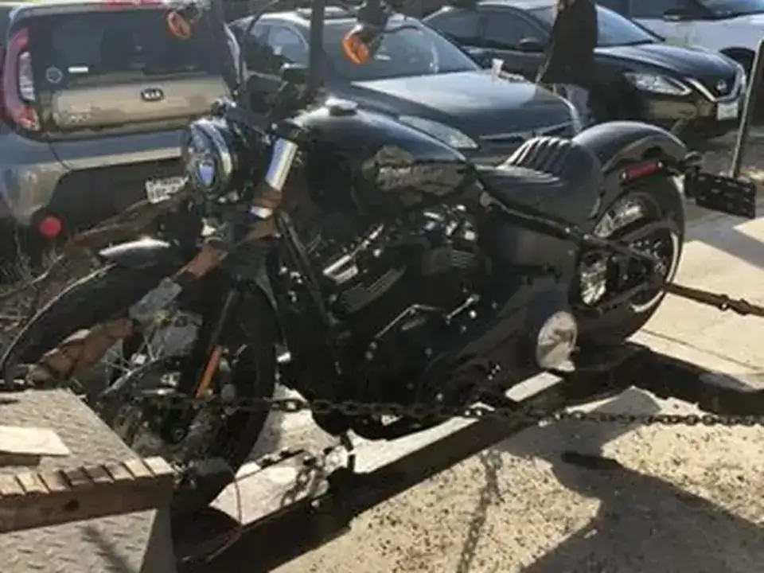
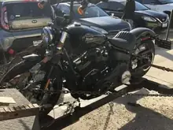
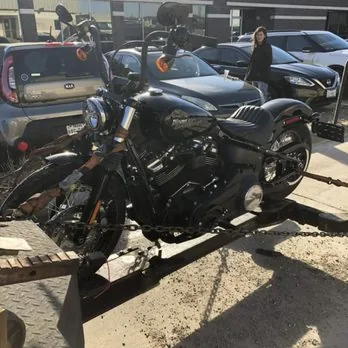
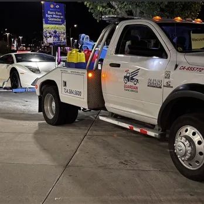
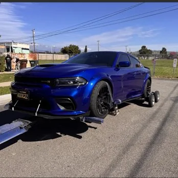
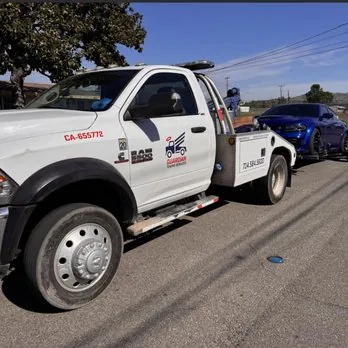
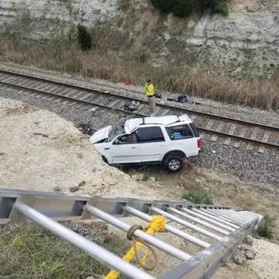
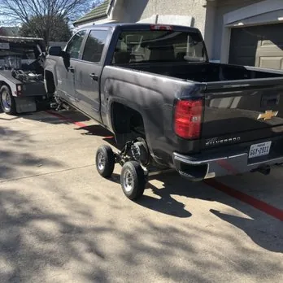
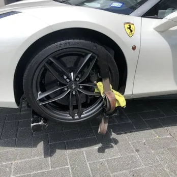

# Guardian Towing Service — edits to index.html

Two jobs: **(A)** strip every motorcycle reference, **(B)** replace the About block with a real owner-operator "About Us."

The site is a single hand-coded `index.html`. Everything below is find-and-replace in that one file. Nine edits total.

---

# PART A — Remove motorcycle references

There are **8 places** in the file. Do all of them, or Google will keep showing you for motorcycle towing.

---

### A1. Meta description (in `<head>`, ~line 15)

**Find:**

```html
<meta name="description" content="24-hour towing, recovery and roadside assistance across the Huntington Beach area. Light and heavy towing, lockouts, winch-outs, motorcycle towing and more. Call (714) 584-5600.">
```

**Replace with:**

```html
<meta name="description" content="24-hour towing, recovery and roadside assistance across the Huntington Beach area. Light and heavy towing, lockouts, winch-outs, vehicle recovery and more. Call (714) 584-5600.">
```

---

### A2. Hero slide 9 (the Harley photo)

**Find and DELETE this entire line:**

```html
            
```

---

### A3. Hero thumbnail 9

**Find and DELETE this entire line:**

```html
            <button class="hero-thumb" type="button" role="tab" aria-selected="false" aria-controls="hero-stage" aria-label="Show photo 9: Harley-Davidson motorcycle strapped down for motorcycle towing"></button>
```

> The slideshow script counts slides dynamically, so removing these two lines just leaves you with an 8-photo slider. Nothing else to renumber. You can also delete `assets/slide-9.webp` and `assets/thumb-9.webp` from the folder.

---

### A4. Trust bar strip

**Find:**

```html
      <span>Motorcycles, trailers, trucks &amp; SUVs</span>
```

**Replace with:**

```html
      <span>Trailers, trucks, SUVs &amp; exotics</span>
```

---

### A5. Services grid — remove card 03 and renumber

The numbers are hard-coded, so replace the **whole grid**.

**Find** the block starting `<div class="services-grid">` and ending with its closing `</div>` (it contains 8 `.svc` cards plus the `svc-more` call card), and **replace it with:**

```html
    <div class="services-grid">
      <div class="svc"><span class="num">01</span><h3>Trailer towing</h3><p>Utility, boat, and cargo trailers moved or recovered.</p></div>
      <div class="svc"><span class="num">02</span><h3>Truck or SUV towing</h3><p>Full-size trucks and SUVs, flatbed or wheel-lift.</p></div>
      <div class="svc"><span class="num">03</span><h3>Lockouts</h3><p>Lost the keys to your baby? We'll get it done.</p></div>
      <div class="svc"><span class="num">04</span><h3>Stuck vehicle recovery</h3><p>Garages, sand, ditches, tight spots. Wheel dollies when needed.</p></div>
      <div class="svc"><span class="num">05</span><h3>Battery replacement</h3><p>Tested and swapped on the spot so you can drive off.</p></div>
      <div class="svc"><span class="num">06</span><h3>Gas delivery</h3><p>Fuel brought to you wherever you ran dry.</p></div>
      <div class="svc"><span class="num">07</span><h3>Car transport</h3><p>Point-to-point vehicle moves, dealerships and shops included.</p></div>
      <a class="svc-more" href="tel:+17145845600">
        <span class="num">08</span>
        <span>
          <span class="t">Something else?</span>
          <span class="d">Call and describe it — (714) 584-5600</span>
        </span>
      </a>
    </div>
```

> That leaves 8 tiles instead of 9. If you want to keep the grid at 9 and fill the hole, a good replacement card is: `<div class="svc"><span class="num">03</span><h3>Accident &amp; breakdown recovery</h3><p>Disabled vehicles cleared off the road or out of a lot.</p></div>` — drop it in and renumber the rest back to 09.

---

### A6. Gallery photo 7 (the Harley photo)

**Find and DELETE this entire line:**

```html
        <figure></figure>
```

Then in the same section, **find:**

```html
        <span class="c">7 photos</span>
```

**Replace with:**

```html
        <span class="c">6 photos</span>
```

> 6 photos is actually better here — the gallery is a 3-across grid, so you get two clean rows instead of a stray seventh tile.

---

### A7. Request form dropdown

**Find and DELETE this line:**

```html
              <option>Motorcycle towing</option>
```

---

### A8. Structured data (the JSON-LD near the bottom)

**Find and DELETE this line:**

```json
      { "@type": "Offer", "itemOffered": { "@type": "Service", "name": "Motorcycle towing" } },
```

> This is the one most people miss. It's what feeds Google's service list for the business.

---

# PART B — The About Us section

### B1. Add a nav link

**Find:**

```html
      <a class="nav-link" href="#services">Services</a>
      <a class="nav-link" href="#pricing">Pricing</a>
      <a class="nav-link" href="#reviews">Reviews</a>
      <a class="nav-link" href="#hours">Hours &amp; Area</a>
```

**Replace with:**

```html
      <a class="nav-link" href="#services">Services</a>
      <a class="nav-link" href="#pricing">Pricing</a>
      <a class="nav-link" href="#about">About</a>
      <a class="nav-link" href="#reviews">Reviews</a>
      <a class="nav-link" href="#hours">Hours &amp; Area</a>
```

---

### B2. Add two CSS rules

The new section uses two classes that don't exist yet. Paste these into the `<style>` block, right after the existing `.about-lead { ... }` rule:

```css
.about-body { color: var(--muted); font-size: 16px; line-height: 1.7; margin-top: 20px; max-width: 54ch; text-wrap: pretty; }
.about-body strong { color: var(--ink, inherit); font-weight: 600; }
```

> If your CSS variable for body text isn't `--ink`, the `strong` rule harmlessly falls back to inheriting. No other change needed.

---

### B3. Replace the whole About section

**Find** the block that starts with `<section class="about" aria-labelledby="about-h">` and ends with its closing `</section>`, and **replace it with this** (this already has the motorcycle photo from A6 removed and the count fixed — if you paste this, you can skip A6):

```html
  <section class="about" id="about" aria-labelledby="about-h">
    <div>
      <span class="eyebrow">About us</span>
      <h2 id="about-h" class="h-display">One truck. One operator. No handoffs.</h2>
      <p class="about-lead">When your roadside provider says they can't, Guardian comes and gets it done.</p>
      <p class="about-body">Guardian is owner-operated, and that is the whole point. The person who answers the phone is the same person who shows up, hooks your vehicle, and drives it where it's going. Nothing gets passed to a subcontractor, nothing gets explained twice, and nobody arrives who hasn't been doing this for 25 years.</p>
      <p class="about-body">It's also why the work looks the way it does. Soft straps on wheels that need them. Wheel dollies when a car won't roll. The extra ten minutes it takes to back a car out of a tight parking garage without touching a bumper. Twenty-five years in this industry means there isn't much that hasn't come up before — and running one truck means there's never a reason to rush your car to get to the next call.</p>
      <p class="about-body">Staying small is deliberate. You get a straight answer on the phone about whether the job can be done, an honest arrival time instead of a guess, and a price quoted before anyone is dispatched.</p>
      <div class="stats">
        <div class="stat"><div class="v">25</div><div class="k">Years in towing</div></div>
        <div class="stat"><div class="v">1</div><div class="k">Owner-operator</div></div>
        <div class="stat"><div class="v">24/7</div><div class="k">Dispatch</div></div>
        <div class="stat"><div class="v">5.0</div><div class="k">Yelp rating</div></div>
      </div>
    </div>
    <div>
      <div class="gallery-head">
        <span class="eyebrow">Photos</span>
        <span class="c">6 photos</span>
      </div>
      <div class="gallery">
        <figure></figure>
        <figure></figure>
        <figure></figure>
        <figure></figure>
        <figure></figure>
        <figure></figure>
      </div>
    </div>
  </section>
```

**What changed vs. what's on the site now:**

- Added `id="about"` so the new nav link has somewhere to land.
- Added a real headline (`One truck. One operator. No handoffs.`) — the section had no heading before, just an eyebrow and a sentence.
- Three body paragraphs carrying the one-man-show and attention-to-detail message, using specifics (soft straps, wheel dollies, tight garages) rather than adjectives.
- Added a fourth stat, **1 / Owner-operator**, which is the single clearest way to say it.
- Gallery trimmed to 6, motorcycle photo gone.

---

## After you paste

1. Search the file for `motorcycle`, `Motorcycle`, `Harley`, and `Moto` — you should get **zero** hits.
2. Load the page and click through the hero thumbnails; there should be 8 and they should all still advance.
3. Check the About section at phone width — the grid collapses to one column under 920px, so the four stats will wrap to two rows. That looks fine.
4. Because the meta description and the JSON-LD both changed, resubmit the URL in Google Search Console so the service list updates instead of waiting for a recrawl.

## One thing worth deciding

Your Yelp page and Google Business Profile almost certainly list motorcycle towing as a service too. Stripping it from the site but leaving it on those profiles means the calls keep coming. Worth updating both at the same time.
